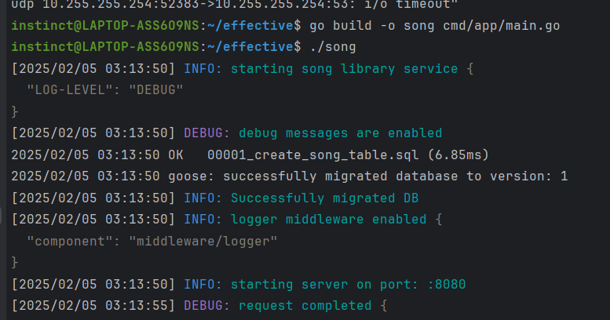

# song-library

## Обзор
Сервис Библиотеки песен - это сервис на Go,предоставляющий возможность взаимодействовать с библиотекой песен. Эта документация предоставляет обзор сервиса, его API-эндпоинтов и как настроить и запустить его.

## Задача:
- [ ] Получение данных библиотеки с фильтрацией по всем полям и
  пагинацией
- [ ] Получение текста песни с пагинацией по куплетам
- [ ] Удаление песни
- [ ] Изменение данных песни
- [ ] Добавление новой песни в формате
- [ ] При добавлении сделать запрос в АПИ, описанного сваггером. Апи,
  описанный сваггером, будет поднят при проверке тестового задания.
  Реализовывать его отдельно не нужно
- [ ] Обогащенную информацию положить в БД postgres (структура БД должна
  быть создана путем миграций при старте сервиса)
- [ ] Покрыть код debug- и info-логами
- [ ] Вынести конфигурационные данные в .env-файл
- [ ] Сгенерировать сваггер на реализованное АПИ

- [ ] Реализован обработчик `POST /song`
- [ ] Реализован обработчик `GET /songs`
- [ ] Реализован обработчик `GET /song/{id}`
- [ ] Реализован обработчик `DELETE /song/{id}`
- [ ] Реализован обработчик `PUT /song/{id}`
- [ ] Реализован обработчик `PUT /swagger/`
### Используемые технологии:

- Go
- сhi framework - для API хандлера
- env,godotenv - для конфигурации
- slog - для логирования
- Docker, docker-compose
- Swagger

## Содержание

1. [Конфигурация](#конфигурация)
2. [Запуск Сервиса](#запуск-сервиса)
3. [API Эндпоинты](#api-эндпоинты)
 


## Конфигурация

Конфигурация сервиса указана в файле local.env в виде переменных окружения.
Подробно можно посмотреть и поменять в файле
``` 
config/local.env
```
#### Пример:
```dotenv
HTTP_PORT=:8080
LOG_LEVEL=DEBUG

# for go run cmd/app/main.go DB_HOST=localhost
DB_HOST=db
DB_PORT=5432
DB_USER=postgres
DB_PASSWORD=postgres
DB_NAME=postgres
SSL_MODE=disable

LIMIT=10
PAGE=1
VERSE=3
```

## Запуск сервиса

1. Клонируем репозиторий в вашу рабочую директорию:
```
git clone https://github.com/instinctG/songLibrary.git
```

Запустить сервис можно 2 способами:

- Сбилдить go программу
- Использовать Docker и запустить docker-compose


### Первый способ

Сбилдить приложение :

* Для запуска БД в локалке, в файле local.env поменять DB_HOST=localhost
```sh
go build -o song cmd/app/main.go
```

Запуск сервиса:
```
./song
```

Завершить работу сервиса(graceful-shutdown)
```
Ctrl+C
```

### Второй способ
### docker-compose:
Сбилдить и запустить docker-compose (в первый раз может не получится запустить, надо пробовать заново):

* Для запуска БД в контейнере, в файле local.env поменять DB_HOST=db
```sh
docker-compose up --build
```

Завершить работу сервиса(graceful-shutdown)
```
Ctrl+C
```


Ниже предоставлена информация по эндпоинтам, а также примеры взаимодействия с API.


## Логирование

#### Пример логирования при запуске сервиса :


для более подробных логов лучше запускать на уровне DEBUG(можно задать в local.env)


## API Эндпоинты

Сервис предоставляет Swagger документацию на API-эндпоинты по ссылке, в которую можно будет перейти после запуска приложения(выше):
```
http://localhost:8080/swagger/index.html
```

## P.S:
* Для POST /song - по данной ручке передаются параметры song,group с помощью которых находится информация(text,releaseDate,link) из API Swagger, который по требованию не нужно реализовывать отдельно: 


* API описанный свагером:
```
GET http://localhost:63342/info?song=...&group=...
```

#### API, который реализуем для добавления песни в БД:
- **Эндпоинт**: `/song`
- **Метод**: POST
- **Описание**: Добавляет песню в БД.

- **Тело запроса**: JSON
- **Параметры**:
  - `song`: имя песни
  - `group`: имя группы

#### пример
```json
{
   "song": "Muse",
   "group": "Supermassive Black Hole"
}

```
#### Пример запроса
```
POST http://localhost:8080/song
```
#### Пример ответа(Если все поля введены корректно)


#### Тело ответа
```json
{
  "group": "Muse",
  "id": "1",
  "link": "https://www.youtube.com/watch?v=Xsp3_a-PMTw",
  "releaseDate": "02.01.2006",
  "song": "Supermassive Black Hole",
  "text": "Ooh baby, don't you know I suffer?\nOoh baby, can you hear me moan?"
}
```

